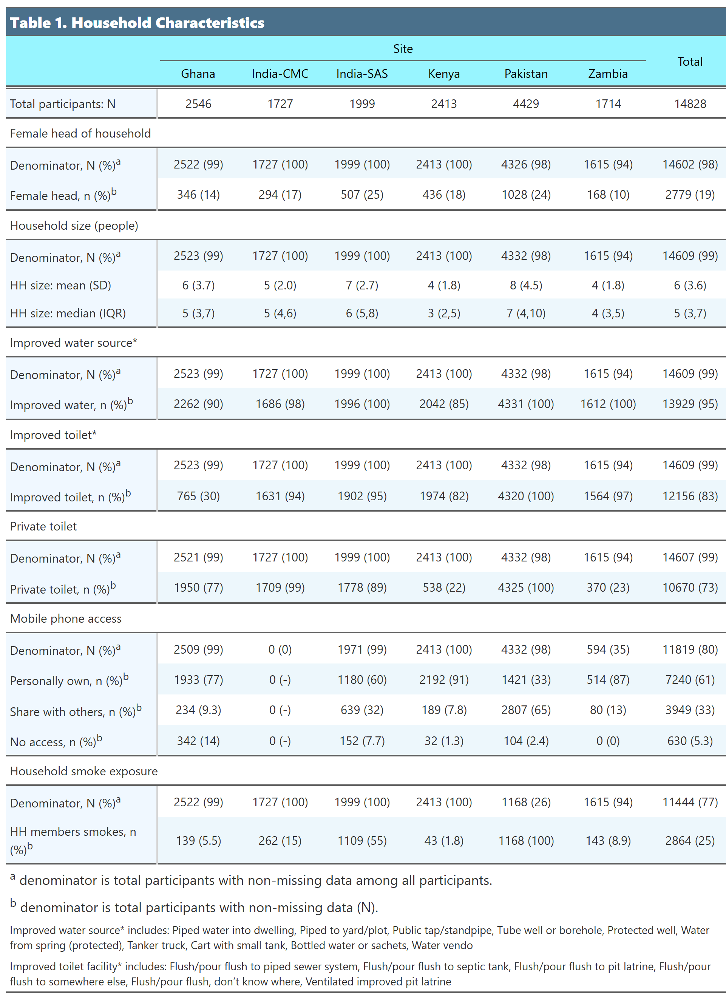
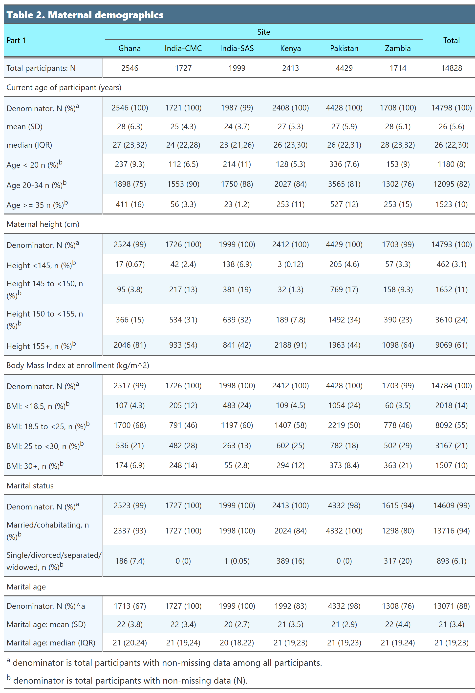
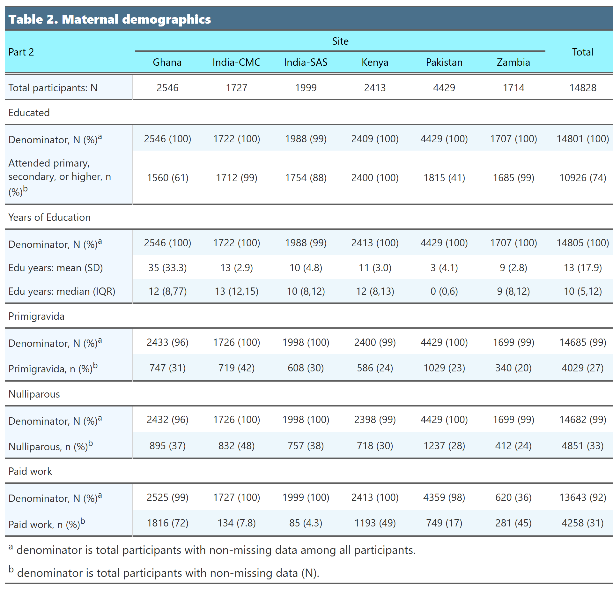
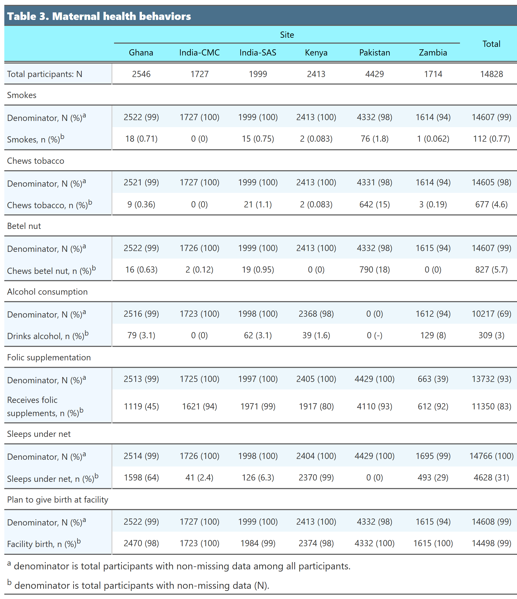
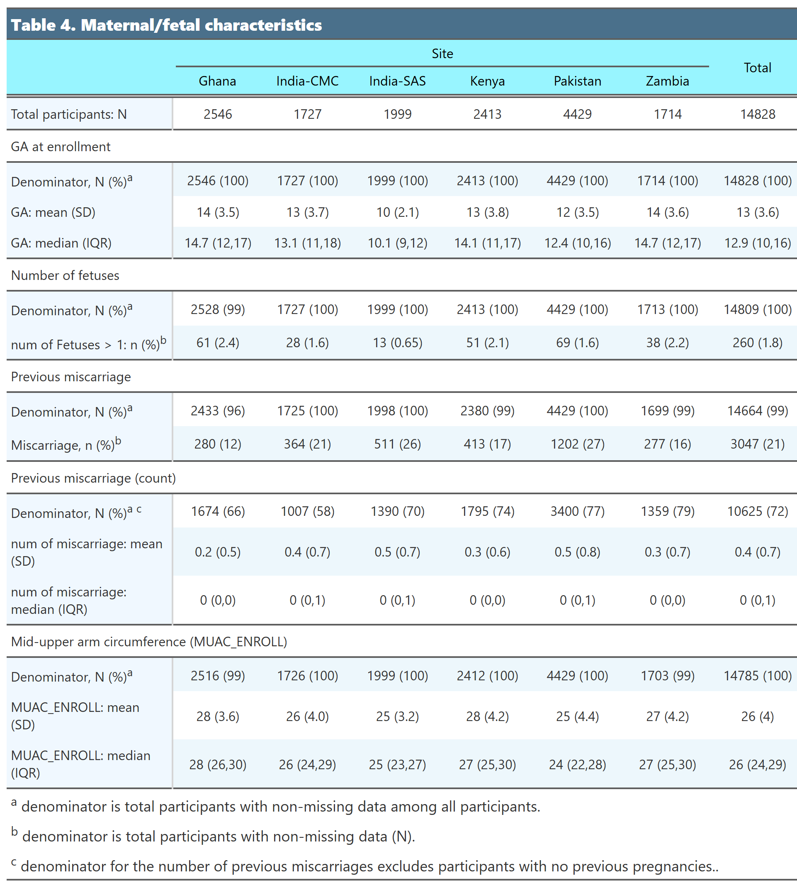

*Demographic table is showing baseline household and individual characteristic.*

**Date of included data upload to Synapse: ** 2025-04-18

\tableofcontents

```{r setup, include=FALSE}
knitr::opts_chunk$set(echo = FALSE, warning = FALSE, message = FALSE, out.width = "100%") 
knitr::opts_chunk$set(out.width = "100%", fig.align = "center")
library(tinytex)
library(tidyverse)
library(lubridate)
library(gt)
library(naniar)
library(emo)
library(webshot2)
library(flextable)
library(officer)
library(kableExtra)
library(ggh4x)

# load("derived_data/df_demo.rda")
load("~/PRISMA-Analysis-Stacie/Maternal-Outcomes/data/df_demo.RData")

#table format 1
tb_theme1 <- function(matrix){
  tb <- matrix %>% 
    gt(
      #show row names
      rownames_to_stub = TRUE
    ) %>% 
    opt_align_table_header(align = "left") %>% 
    #spanner column label
    tab_spanner(
      label = "Site",
      columns = c(-Total)
    ) %>% 
    #use one of the default theme and customize
    opt_stylize(style = 6, color = 'blue') %>% 
    #title style
    tab_style(
      style = list(
        cell_fill(color = "skyblue4"),
        cell_text(weight = "bold"),
        cell_text(v_align = "middle"),
        cell_text(color = "white")
      ),
      locations = list(
        cells_title()
      )
    ) %>% 
    #stub head, spanner column, column label style
    tab_style(
      style = list(
        cell_fill(color = "cadetblue1"),
        cell_text(color = "black"),
        cell_text(v_align = "middle") 
      ),
      locations = list(
        cells_stubhead(),
        cells_column_spanners(),
        cells_column_labels() 
      )
    ) %>% 
    #cell style
    tab_style(
      style = list(
        cell_fill(color = "aliceblue"),
        cell_text(v_align = "middle") 
      ),
      locations = list(
        cells_stub()
      ) 
    ) %>% 
    #column labels align center
    tab_style(
      style = list(
        cell_text(align = "center") 
      ),
      locations = list(
        cells_column_labels(columns = everything())
      )
    ) %>% 
    #table body align right
    tab_style(
      style = list(
        cell_text(align = "center") 
      ),
      locations = list(
        cells_body(columns = everything())
      ) 
    ) %>%
    fmt_markdown(columns = everything()) %>%
    # fix column width
    tab_options(table.width = pct(100)) %>%
    cols_width(1 ~ px(200))
} 

```

\newpage

### Table 1. Household Characteristics 

```{r}
df_demo_a <- df_demo %>% 
  select(SITE, HH_HEAD_FEMALE, HH_SIZE, WATER_IMPROVED, TOILET_IMPROVED, TOILET_SHARED,
        PHONE_ACCESS, HH_SMOKE) %>%
  mutate(across(everything(), ~ ifelse(. < 0, NA, .)))

matrix_demo_a <- df_demo_a %>% 
  group_by(SITE) %>% 
  summarise(
    "Total participants: N" = n(),
    
  ## head of household

    "Denominator, N (%)^a^" = 
      paste0(sum(!is.na(HH_HEAD_FEMALE)), 
             " (", format(round(sum(!is.na(HH_HEAD_FEMALE))/n()*100), digits = 2, nsmall = 0), ")"),

    "Female head, n (%)^b^" = 
      paste0(sum(HH_HEAD_FEMALE == 1, na.rm = TRUE), 
             " (", format(sum(HH_HEAD_FEMALE == 1, na.rm = TRUE)/sum(!is.na(HH_HEAD_FEMALE))*100, digits = 2, nsmall = 0), ")"),
    
    ## Household size
    "Denominator, N (%)^a^ " = 
      paste0(sum(!is.na(HH_SIZE)), 
             " (", format(sum(!is.na(HH_SIZE))/n()*100, digits = 2, nsmall = 0),")"),
    
    "HH size: mean (SD)" = 
      paste0(round(mean(HH_SIZE, na.rm = TRUE)), 
             " (", format(sd(HH_SIZE, na.rm = TRUE), digits = 1, nsmall = 1),")"),
    "HH size: median (IQR)" = 
      paste0(median(HH_SIZE, na.rm = TRUE), 
             " (", quantile(HH_SIZE, 1/4, na.rm = TRUE),",", quantile(HH_SIZE, 3/4, na.rm = TRUE), ")"),
  
  ## water 
    "Denominator, N (%)^a^  " = 
      paste0(sum(!is.na(WATER_IMPROVED)), 
             " (", format(sum(!is.na(WATER_IMPROVED))/n()*100, digits = 2, nsmall = 0), ")"),
    "Improved water, n (%)^b^" = 
      paste0(sum(WATER_IMPROVED == 1, na.rm = TRUE), 
             " (", format(sum(WATER_IMPROVED == 1, na.rm = TRUE)/sum(!is.na(WATER_IMPROVED))*100, digits = 2, nsmall = 0), ")"),
  
  ## improved toilet 
  "Denominator, N (%)^a^   " = 
      paste0(sum(!is.na(TOILET_IMPROVED)), 
             " (", format(sum(!is.na(TOILET_IMPROVED))/n()*100, digits = 2, nsmall = 0), ")"),
   "Improved toilet, n (%)^b^" = 
      paste0(sum(TOILET_IMPROVED == 1, na.rm = TRUE), 
             " (", format(sum(TOILET_IMPROVED == 1, na.rm = TRUE)/sum(!is.na(TOILET_IMPROVED))*100, digits = 2, nsmall = 0), ")"),
     
  ## private toilet
  "Denominator, N (%)^a^    " = 
      paste0(sum(!is.na(TOILET_SHARED)), 
             " (", format(sum(!is.na(TOILET_SHARED))/n()*100, digits = 2, nsmall = 0), ")"),
  "Private toilet, n (%)^b^" = 
      paste0(sum(TOILET_SHARED == 0, na.rm = TRUE), 
             " (", format(sum(TOILET_SHARED == 0, na.rm = TRUE)/sum(!is.na(TOILET_SHARED))*100, digits = 2, nsmall = 0), ")"),

  ## mobile phone access
    "Denominator, N (%)^a^     " = 
      paste0(sum(!is.na(PHONE_ACCESS)), 
             " (", format(sum(!is.na(PHONE_ACCESS))/n()*100, digits = 2, nsmall = 0), ")"),
  
    "Personally own, n (%)^b^" = 
      paste0(sum(PHONE_ACCESS == 1, na.rm = TRUE), 
             " (", format(sum(PHONE_ACCESS == 1, na.rm = TRUE)/sum(!is.na(PHONE_ACCESS))*100, digits = 2, nsmall = 0), ")"),
    "Share with others, n (%)^b^" = 
      paste0(sum(PHONE_ACCESS == 2, na.rm = TRUE), 
             " (", format(sum(PHONE_ACCESS == 2, na.rm = TRUE)/sum(!is.na(PHONE_ACCESS))*100, digits = 2, nsmall = 0), ")"),
    "No access, n (%)^b^" = 
      paste0(sum(PHONE_ACCESS == 3, na.rm = TRUE), 
             " (", format(sum(PHONE_ACCESS == 3, na.rm = TRUE)/sum(!is.na(PHONE_ACCESS))*100, digits = 2, nsmall = 0), ")"),

  ## household smoking
  "Denominator, N (%)^a^      " = 
      paste0(sum(!is.na(HH_SMOKE)), 
             " (", format(sum(!is.na(HH_SMOKE))/n()*100, digits = 2, nsmall = 0), ")"),  
  "HH members smokes, n (%)^b^" = 
      paste0(sum(HH_SMOKE == 1, na.rm = TRUE), 
             " (", format(sum(HH_SMOKE == 1, na.rm = TRUE)/sum(!is.na(HH_SMOKE))*100, digits = 2, nsmall = 0), ")"),

  ) %>% 
  t() %>% as.data.frame() %>% 
  `colnames<-`(c(.[1,])) %>% 
  slice(-1) %>% 
  add_column(
    .after = 6,
    "Total" = df_demo_a %>% 
      summarise(
    "Total participants, n" = n(),
    
  ## head of household

    "Denominator, N (%)^a^" = 
      paste0(sum(!is.na(HH_HEAD_FEMALE)), 
             " (", format(round(sum(!is.na(HH_HEAD_FEMALE))/n()*100), digits = 2, nsmall = 0), ")"),

    "Female head, n (%)^b^" = 
      paste0(sum(HH_HEAD_FEMALE == 1, na.rm = TRUE), 
             " (", format(sum(HH_HEAD_FEMALE == 1, na.rm = TRUE)/sum(!is.na(HH_HEAD_FEMALE))*100, digits = 2, nsmall = 0), ")"),
    
    ## Household size
    "Denominator, N (%)^a^ " = 
      paste0(sum(!is.na(HH_SIZE)), 
             " (", format(sum(!is.na(HH_SIZE))/n()*100, digits = 2, nsmall = 0),")"),
    
    "HH size: mean (SD)" = 
      paste0(round(mean(HH_SIZE, na.rm = TRUE)), 
             " (", format(sd(HH_SIZE, na.rm = TRUE), digits = 1, nsmall = 1),")"),
    "HH size: median (IQR)" = 
      paste0(median(HH_SIZE, na.rm = TRUE), 
             " (", quantile(HH_SIZE, 1/4, na.rm = TRUE),",", quantile(HH_SIZE, 3/4, na.rm = TRUE), ")"),

  ## water 
    "Denominator, N (%)^a^  " = 
      paste0(sum(!is.na(WATER_IMPROVED)), 
             " (", format(sum(!is.na(WATER_IMPROVED))/n()*100, digits = 2, nsmall = 0), ")"),
    "Improved water, n (%)^b^" = 
      paste0(sum(WATER_IMPROVED == 1, na.rm = TRUE), 
             " (", format(sum(WATER_IMPROVED == 1, na.rm = TRUE)/sum(!is.na(WATER_IMPROVED))*100, digits = 2, nsmall = 0), ")"),
  
  ## improved toilet 
  "Denominator, N (%)^a^   " = 
      paste0(sum(!is.na(TOILET_IMPROVED)), 
             " (", format(sum(!is.na(TOILET_IMPROVED))/n()*100, digits = 2, nsmall = 0), ")"),
   "Improved toilet, n (%)^b^" = 
      paste0(sum(TOILET_IMPROVED == 1, na.rm = TRUE), 
             " (", format(sum(TOILET_IMPROVED == 1, na.rm = TRUE)/sum(!is.na(TOILET_IMPROVED))*100, digits = 2, nsmall = 0), ")"),
     
  ## private toilet
  "Denominator, N (%)^a^    " = 
      paste0(sum(!is.na(TOILET_SHARED)), 
             " (", format(sum(!is.na(TOILET_SHARED))/n()*100, digits = 2, nsmall = 0), ")"),
  "Private toilet, n (%)^b^" = 
      paste0(sum(TOILET_SHARED == 0, na.rm = TRUE), 
             " (", format(sum(TOILET_SHARED == 0, na.rm = TRUE)/sum(!is.na(TOILET_SHARED))*100, digits = 2, nsmall = 0), ")"),

  ## mobile phone access
    "Denominator, N (%)^a^     " = 
      paste0(sum(!is.na(PHONE_ACCESS)), 
             " (", format(sum(!is.na(PHONE_ACCESS))/n()*100, digits = 2, nsmall = 0), ")"),
  
    "Personally own, n (%)^b^" = 
      paste0(sum(PHONE_ACCESS == 1, na.rm = TRUE), 
             " (", format(sum(PHONE_ACCESS == 1, na.rm = TRUE)/sum(!is.na(PHONE_ACCESS))*100, digits = 2, nsmall = 0), ")"),
    "Share with others, n (%)^b^" = 
      paste0(sum(PHONE_ACCESS == 2, na.rm = TRUE), 
             " (", format(sum(PHONE_ACCESS == 2, na.rm = TRUE)/sum(!is.na(PHONE_ACCESS))*100, digits = 2, nsmall = 0), ")"),
    "No access, n (%)^b^" = 
      paste0(sum(PHONE_ACCESS == 3, na.rm = TRUE), 
             " (", format(sum(PHONE_ACCESS == 3, na.rm = TRUE)/sum(!is.na(PHONE_ACCESS))*100, digits = 2, nsmall = 0), ")"),

  ## household smoking
  "Denominator, N (%)^a^      " = 
      paste0(sum(!is.na(HH_SMOKE)), 
             " (", format(sum(!is.na(HH_SMOKE))/n()*100, digits = 2, nsmall = 0), ")"),  
  "HH members smokes, n (%)^b^" = 
      paste0(sum(HH_SMOKE == 1, na.rm = TRUE), 
             " (", format(sum(HH_SMOKE == 1, na.rm = TRUE)/sum(!is.na(HH_SMOKE))*100, digits = 2, nsmall = 0), ")"),

      ) %>% 
      t() %>% unlist()
  ) %>% 
  mutate_all(funs(str_replace(., "(NaN)", "-")))
```

```{r}
#generate table 
tb_demo_a <- tb_theme1(matrix_demo_a) %>% 
  #table title
  tab_header(
    title = md("**Table 1. Household Characteristics**")
  ) %>% 
  tab_row_group(
    label = "Female head of household",
    rows = 2:3
  ) %>% 
  tab_row_group(
    label = "Household size (people)",
    rows = 4:6
  ) %>% 
  tab_row_group(
    label = "Improved water source*",
    rows = 7:8
  ) %>%  
  tab_row_group(
    label = "Improved toilet*",
    rows = 9:10
  ) %>% 
    tab_row_group(
    label = "Private toilet",
    rows = 11:12
  ) %>% 
    tab_row_group(
    label = "Mobile phone access",
    rows = 13:16
  ) %>% 
    tab_row_group(
    label = "Household smoke exposure",
    rows = 17:18
  ) %>% 
  row_group_order(groups = c(NA, "Female head of household",
                             "Household size (people)", 
                             "Improved water source*", 
                             "Improved toilet*",
                             "Private toilet",
                             "Mobile phone access",
                             "Household smoke exposure")) %>% 
  tab_footnote(
        footnote = html("<span style='font-size: 18px'><sup>a</sup> denominator is total participants with non-missing data among all participants.</span>")
  ) %>%
    tab_footnote(
        footnote = html("<span style='font-size: 18px'><sup>b</sup> denominator is total participants with non-missing data (N).</span>")
  ) %>%
  tab_footnote(
    footnote = c("Improved water source* includes: Piped water into dwelling, Piped to yard/plot, 
                 Public tap/standpipe, Tube well or borehole, Protected well, Water from spring (protected),
                 Tanker truck, Cart with small tank, Bottled water or sachets, Water vendo")
  ) %>%
  tab_footnote(
    footnote = c("Improved toilet facility* includes: Flush/pour flush to piped sewer system,
    Flush/pour flush to septic tank, Flush/pour flush to pit latrine, 
    Flush/pour flush to somewhere else, Flush/pour flush, don’t know where,
    Ventilated improved pit latrine")
  ) 


```

```{r, out.width = '100%'}
png_demo_a <- tb_demo_a %>% gtsave("demo_a.png", expand = 10)

```

\newpage

### Table 2. Individual Characteristics
```{r}
df_demo_b <- df_demo %>%
  select(SITE, MAT_AGE, MAT_AGE_UNDER18,  BMI_LEVEL_ENROLL, HEIGHT_GROUP, 
         MARRIED, MARRY_AGE, EDUCATED, SCHOOL_YRS, PRIMIGRAVIDA, NULLIPAROUS,
         PAID_WORK) %>%
  mutate(across(everything(), ~ ifelse(. < 0, NA, .)))

matrix_demo_b <- df_demo_b %>%
  group_by(SITE) %>%
  summarise(
    "Total participants: N" = n(),
    
  ## age 
    "Denominator, N (%)^a^" =
      paste0(sum(!is.na(MAT_AGE)),
             " (", format(sum(!is.na(MAT_AGE))/n()*100, digits = 1, nsmall = 0),")"),
    "mean (SD)" =
      paste0(round(mean(MAT_AGE, na.rm = TRUE)),
             " (", format(sd(MAT_AGE, na.rm = TRUE), digits = 1, nsmall = 1),")"),
    "median (IQR)" = 
      paste0(median(MAT_AGE, na.rm = TRUE), 
             " (", quantile(MAT_AGE, 1/4, na.rm = TRUE),",", quantile(MAT_AGE, 3/4, na.rm = TRUE), ")"),
    "Age < 20 n (%)^b^" =
      paste0(sum(MAT_AGE > 0 & MAT_AGE < 20, na.rm = TRUE),
             " (", format(sum(MAT_AGE > 0 & MAT_AGE < 20, na.rm = TRUE)/sum(!is.na(MAT_AGE))*100, digits = 2, nsmall = 0), ")"),
    "Age 20-34 n (%)^b^" =
      paste0(sum(MAT_AGE >= 20 & MAT_AGE <= 34, na.rm = TRUE),
             " (", format(sum(MAT_AGE >= 20 & MAT_AGE <= 34, na.rm = TRUE)/sum(!is.na(MAT_AGE))*100, digits = 2, nsmall = 0), ")"),
    "Age >= 35 n (%)^b^" =
      paste0(sum(MAT_AGE >= 35, na.rm = TRUE),
             " (", format(sum(MAT_AGE >= 35, na.rm = TRUE)/sum(!is.na(MAT_AGE))*100, digits = 2, nsmall = 0), ")"),

  ## maternal height
    "Denominator, N (%)^a^ " =
      paste0(sum(!is.na(HEIGHT_GROUP)),
             " (", format(sum(!is.na(HEIGHT_GROUP))/n()*100, digits = 2, nsmall = 0), ")"),
    "Height <145, n (%)^b^" =
      paste0(sum(HEIGHT_GROUP == 1, na.rm = TRUE),
             " (", format(sum(HEIGHT_GROUP == 1, na.rm = TRUE)/sum(!is.na(HEIGHT_GROUP))*100, digits = 2, nsmall = 0), ")"),
    "Height 145 to <150, n (%)^b^" =
      paste0(sum(HEIGHT_GROUP == 2, na.rm = TRUE),
             " (", format(sum(HEIGHT_GROUP == 2, na.rm = TRUE)/sum(!is.na(HEIGHT_GROUP))*100, digits = 2, nsmall = 0), ")"),
    "Height 150 to <155, n (%)^b^" =
      paste0(sum(HEIGHT_GROUP == 3, na.rm = TRUE),
             " (", format(sum(HEIGHT_GROUP == 3, na.rm = TRUE)/sum(!is.na(HEIGHT_GROUP))*100, digits = 2, nsmall = 0), ")"),
    "Height 155+, n (%)^b^" =
      paste0(sum(HEIGHT_GROUP == 4, na.rm = TRUE),
             " (", format(sum(HEIGHT_GROUP == 4, na.rm = TRUE)/sum(!is.na(HEIGHT_GROUP))*100, digits = 2, nsmall = 0), ")"),

  ## BMI
      "Denominator, N (%)^a^  " =
      paste0(sum(!is.na(BMI_LEVEL_ENROLL)),
             " (", format(sum(!is.na(BMI_LEVEL_ENROLL))/n()*100, digits = 2, nsmall = 0), ")"),  
     "BMI: <18.5, n (%)^b^" =
      paste0(sum(BMI_LEVEL_ENROLL == 1, na.rm = TRUE),
             " (", format(sum(BMI_LEVEL_ENROLL == 1, na.rm = TRUE)/sum(!is.na(BMI_LEVEL_ENROLL))*100, digits = 2, nsmall = 0), ")"),
    "BMI: 18.5 to <25, n (%)^b^" =
      paste0(sum(BMI_LEVEL_ENROLL == 2, na.rm = TRUE),
             " (", format(sum(BMI_LEVEL_ENROLL == 2, na.rm = TRUE)/sum(!is.na(BMI_LEVEL_ENROLL))*100, digits = 2, nsmall = 0), ")"),
    "BMI: 25 to <30, n (%)^b^" =
      paste0(sum(BMI_LEVEL_ENROLL == 3, na.rm = TRUE),
             " (", format(sum(BMI_LEVEL_ENROLL == 3, na.rm = TRUE)/sum(!is.na(BMI_LEVEL_ENROLL))*100, digits = 2, nsmall = 0), ")"),
    "BMI: 30+, n (%)^b^" =
      paste0(sum(BMI_LEVEL_ENROLL == 4, na.rm = TRUE),
             " (", format(sum(BMI_LEVEL_ENROLL == 4, na.rm = TRUE)/sum(!is.na(BMI_LEVEL_ENROLL))*100, digits = 2, nsmall = 0), ")"),

  ## marital status
    "Denominator, N (%)^a^   " =
      paste0(sum(!is.na(MARRIED)),
             " (", format(sum(!is.na(MARRIED))/n()*100, digits = 2, nsmall = 0), ")"),
     "Married/cohabitating, n (%)^b^" =
      paste0(sum(MARRIED == 1, na.rm = TRUE),
             " (", format(sum(MARRIED == 1, na.rm = TRUE)/sum(!is.na(MARRIED))*100, digits = 2, nsmall = 0), ")"),
    "Single/divorced/separated/ widowed, n (%)^b^" =
      paste0(sum(MARRIED == 0, na.rm = TRUE),
             " (", format(sum(MARRIED == 0, na.rm = TRUE)/sum(!is.na(MARRIED))*100, digits = 2, nsmall = 0), ")"),
  ## marital age
    "Denominator, N (%)^a          " =
      paste0(sum(!is.na(MARRY_AGE)),
             " (", format(sum(!is.na(MARRY_AGE))/n()*100, digits = 2, nsmall = 0),")"),  
     "Marital age: mean (SD)" =
      paste0(round(mean(MARRY_AGE, na.rm = TRUE)),
             " (", format(sd(MARRY_AGE, na.rm = TRUE), digits = 1, nsmall = 1),")"),
    "Marital age: median (IQR)" = 
      paste0(median(MARRY_AGE, na.rm = TRUE), 
             " (", quantile(MARRY_AGE, 1/4, na.rm = TRUE),",", quantile(MARRY_AGE, 3/4, na.rm = TRUE), ")"),

  ## maternal education 
    "Denominator, N (%)^a^         " =
      paste0(sum(!is.na(EDUCATED)),
             " (", format(sum(!is.na(EDUCATED))/n()*100, digits = 2, nsmall = 0), ")"),
    "Attended primary, secondary, or higher, n (%)^b^" =
      paste0(sum(EDUCATED == 1, na.rm = TRUE),
             " (", format(sum(EDUCATED == 1, na.rm = TRUE)/sum(!is.na(EDUCATED))*100, digits = 2, nsmall = 0), ")"),

  ## years of education
    "Denominator, N (%)^a^    " =
      paste0(sum(!is.na(SCHOOL_YRS)),
             " (", format(sum(!is.na(SCHOOL_YRS))/n()*100, digits = 2, nsmall = 0),")"),
    "Edu years: mean (SD)" =
      paste0(round(mean(SCHOOL_YRS, na.rm = TRUE)),
             " (", format(sd(SCHOOL_YRS, na.rm = TRUE), digits = 1, nsmall = 1),")"),
    "Edu years: median (IQR)" = 
      paste0(median(SCHOOL_YRS, na.rm = TRUE), 
             " (", quantile(SCHOOL_YRS, 1/4, na.rm = TRUE),",", quantile(SCHOOL_YRS, 3/4, na.rm = TRUE), ")"),

  ## primigravia
    "Denominator, N (%)^a^     " =
      paste0(sum(!is.na(PRIMIGRAVIDA)),
             " (", format(sum(!is.na(PRIMIGRAVIDA))/n()*100, digits = 2, nsmall = 0), ")"),  
    "Primigravida, n (%)^b^" =
      paste0(sum(PRIMIGRAVIDA == 1, na.rm = TRUE),
             " (", format(sum(PRIMIGRAVIDA == 1, na.rm = TRUE)/sum(!is.na(PRIMIGRAVIDA))*100, digits = 2, nsmall = 0), ")"),
  
  ## Nulliparous
    "Denominator, N (%)^a^      " =
      paste0(sum(!is.na(NULLIPAROUS)),
             " (", format(sum(!is.na(NULLIPAROUS))/n()*100, digits = 2, nsmall = 0), ")"),
  
    "Nulliparous, n (%)^b^" =
      paste0(sum(NULLIPAROUS == 1, na.rm = TRUE),
             " (", format(sum(NULLIPAROUS == 1, na.rm = TRUE)/sum(!is.na(NULLIPAROUS))*100, digits = 2, nsmall = 0), ")"),
  
  ## paid work
    "Denominator, N (%)^a^       " =
      paste0(sum(!is.na(PAID_WORK)),
             " (", format(sum(!is.na(PAID_WORK))/n()*100, digits = 2, nsmall = 0), ")"),
    "Paid work, n (%)^b^" =
      paste0(sum(PAID_WORK == 1, na.rm = TRUE),
             " (", format(sum(PAID_WORK == 1, na.rm = TRUE)/sum(!is.na(PAID_WORK))*100, digits = 2, nsmall = 0), ")"),
  ) %>%
  t() %>% as.data.frame() %>%
  `colnames<-`(c(.[1,])) %>%
  slice(-1) %>%
  add_column(
    .after = 6,
    "Total" = df_demo_b %>%
      summarise(
    "Total participants: N" = n(),
    
  ## age 
    "Denominator, N (%)^a^" =
      paste0(sum(!is.na(MAT_AGE)),
             " (", format(sum(!is.na(MAT_AGE))/n()*100, digits = 1, nsmall = 0),")"),
    "mean (SD)" =
      paste0(round(mean(MAT_AGE, na.rm = TRUE)),
             " (", format(sd(MAT_AGE, na.rm = TRUE), digits = 1, nsmall = 1),")"),
    "median (IQR)" = 
      paste0(median(MAT_AGE, na.rm = TRUE), 
             " (", quantile(MAT_AGE, 1/4, na.rm = TRUE),",", quantile(MAT_AGE, 3/4, na.rm = TRUE), ")"),
    "Age < 20, n (%)^b^" =
      paste0(sum(MAT_AGE > 0 & MAT_AGE < 20, na.rm = TRUE),
             " (", format(sum(MAT_AGE > 0 & MAT_AGE < 20, na.rm = TRUE)/sum(!is.na(MAT_AGE))*100, digits = 2, nsmall = 0), ")"),
    "Age 20-34, n (%)^b^" =
      paste0(sum(MAT_AGE >= 20 & MAT_AGE <= 34, na.rm = TRUE),
             " (", format(sum(MAT_AGE >= 20 & MAT_AGE <= 34, na.rm = TRUE)/sum(!is.na(MAT_AGE))*100, digits = 2, nsmall = 0), ")"),
    "Age >= 35, n (%)^b^" =
      paste0(sum(MAT_AGE >= 35, na.rm = TRUE),
             " (", format(sum(MAT_AGE >= 35, na.rm = TRUE)/sum(!is.na(MAT_AGE))*100, digits = 2, nsmall = 0), ")"),

  ## maternal height
    "Denominator, N (%)^a^ " =
      paste0(sum(!is.na(HEIGHT_GROUP)),
             " (", format(sum(!is.na(HEIGHT_GROUP))/n()*100, digits = 2, nsmall = 0), ")"),
    "Height <145, n (%)^b^" =
      paste0(sum(HEIGHT_GROUP == 1, na.rm = TRUE),
             " (", format(sum(HEIGHT_GROUP == 1, na.rm = TRUE)/sum(!is.na(HEIGHT_GROUP))*100, digits = 2, nsmall = 0), ")"),
    "Height 145 to <150, n (%)^b^" =
      paste0(sum(HEIGHT_GROUP == 2, na.rm = TRUE),
             " (", format(sum(HEIGHT_GROUP == 2, na.rm = TRUE)/sum(!is.na(HEIGHT_GROUP))*100, digits = 2, nsmall = 0), ")"),
    "Height 150 to <155, n (%)^b^" =
      paste0(sum(HEIGHT_GROUP == 3, na.rm = TRUE),
             " (", format(sum(HEIGHT_GROUP == 3, na.rm = TRUE)/sum(!is.na(HEIGHT_GROUP))*100, digits = 2, nsmall = 0), ")"),
    "Height 155+, n (%)^b^" =
      paste0(sum(HEIGHT_GROUP == 4, na.rm = TRUE),
             " (", format(sum(HEIGHT_GROUP == 4, na.rm = TRUE)/sum(!is.na(HEIGHT_GROUP))*100, digits = 2, nsmall = 0), ")"),

  ## BMI
      "Denominator, N (%)^a^  " =
      paste0(sum(!is.na(BMI_LEVEL_ENROLL)),
             " (", format(sum(!is.na(BMI_LEVEL_ENROLL))/n()*100, digits = 2, nsmall = 0), ")"),  
     "BMI: <18.5, n (%)^b^" =
      paste0(sum(BMI_LEVEL_ENROLL == 1, na.rm = TRUE),
             " (", format(sum(BMI_LEVEL_ENROLL == 1, na.rm = TRUE)/sum(!is.na(BMI_LEVEL_ENROLL))*100, digits = 2, nsmall = 0), ")"),
    "BMI: 18.5 to <25, n (%)^b^" =
      paste0(sum(BMI_LEVEL_ENROLL == 2, na.rm = TRUE),
             " (", format(sum(BMI_LEVEL_ENROLL == 2, na.rm = TRUE)/sum(!is.na(BMI_LEVEL_ENROLL))*100, digits = 2, nsmall = 0), ")"),
    "BMI: 25 to <30, n (%)^b^" =
      paste0(sum(BMI_LEVEL_ENROLL == 3, na.rm = TRUE),
             " (", format(sum(BMI_LEVEL_ENROLL == 3, na.rm = TRUE)/sum(!is.na(BMI_LEVEL_ENROLL))*100, digits = 2, nsmall = 0), ")"),
    "BMI: 30+, n (%)^b^" =
      paste0(sum(BMI_LEVEL_ENROLL == 4, na.rm = TRUE),
             " (", format(sum(BMI_LEVEL_ENROLL == 4, na.rm = TRUE)/sum(!is.na(BMI_LEVEL_ENROLL))*100, digits = 2, nsmall = 0), ")"),

  ## marital status
    "Denominator, N (%)^a^   " =
      paste0(sum(!is.na(MARRIED)),
             " (", format(sum(!is.na(MARRIED))/n()*100, digits = 2, nsmall = 0), ")"),
     "Married/cohabitating, n (%)^b^" =
      paste0(sum(MARRIED == 1, na.rm = TRUE),
             " (", format(sum(MARRIED == 1, na.rm = TRUE)/sum(!is.na(MARRIED))*100, digits = 2, nsmall = 0), ")"),
    "Single/divorced/separated/ widowed, n (%)^b^" =
      paste0(sum(MARRIED == 0, na.rm = TRUE),
             " (", format(sum(MARRIED == 0, na.rm = TRUE)/sum(!is.na(MARRIED))*100, digits = 2, nsmall = 0), ")"),
  ## marital age
    "Denominator, N (%)^a          " =
      paste0(sum(!is.na(MARRY_AGE)),
             " (", format(sum(!is.na(MARRY_AGE))/n()*100, digits = 2, nsmall = 0),")"),  
     "Marital age: mean (SD)" =
      paste0(round(mean(MARRY_AGE, na.rm = TRUE)),
             " (", format(sd(MARRY_AGE, na.rm = TRUE), digits = 1, nsmall = 1),")"),
    "Marital age: median (IQR)" = 
      paste0(median(MARRY_AGE, na.rm = TRUE), 
             " (", quantile(MARRY_AGE, 1/4, na.rm = TRUE),",", quantile(MARRY_AGE, 3/4, na.rm = TRUE), ")"),

  ## maternal education 
    "Denominator, N (%)^a^         " =
      paste0(sum(!is.na(EDUCATED)),
             " (", format(sum(!is.na(EDUCATED))/n()*100, digits = 2, nsmall = 0), ")"),
    "Attended primary, secondary, or higher, n (%)^b^" =
      paste0(sum(EDUCATED == 1, na.rm = TRUE),
             " (", format(sum(EDUCATED == 1, na.rm = TRUE)/sum(!is.na(EDUCATED))*100, digits = 2, nsmall = 0), ")"),

  ## years of education
    "Denominator, N (%)^a^    " =
      paste0(sum(!is.na(SCHOOL_YRS)),
             " (", format(sum(!is.na(SCHOOL_YRS))/n()*100, digits = 2, nsmall = 0),")"),
    "Edu years: mean (SD)" =
      paste0(round(mean(SCHOOL_YRS, na.rm = TRUE)),
             " (", format(sd(SCHOOL_YRS, na.rm = TRUE), digits = 1, nsmall = 1),")"),
    "Edu years: median (IQR)" = 
      paste0(median(SCHOOL_YRS, na.rm = TRUE), 
             " (", quantile(SCHOOL_YRS, 1/4, na.rm = TRUE),",", quantile(SCHOOL_YRS, 3/4, na.rm = TRUE), ")"),

  ## primigravia
    "Denominator, N (%)^a^     " =
      paste0(sum(!is.na(PRIMIGRAVIDA)),
             " (", format(sum(!is.na(PRIMIGRAVIDA))/n()*100, digits = 2, nsmall = 0), ")"),  
    "Primigravida, n (%)^b^" =
      paste0(sum(PRIMIGRAVIDA == 1, na.rm = TRUE),
             " (", format(sum(PRIMIGRAVIDA == 1, na.rm = TRUE)/sum(!is.na(PRIMIGRAVIDA))*100, digits = 2, nsmall = 0), ")"),
  
  ## Nulliparous
    "Denominator, N (%)^a^      " =
      paste0(sum(!is.na(NULLIPAROUS)),
             " (", format(sum(!is.na(NULLIPAROUS))/n()*100, digits = 2, nsmall = 0), ")"),
  
    "Nulliparous, n (%)^b^" =
      paste0(sum(NULLIPAROUS == 1, na.rm = TRUE),
             " (", format(sum(NULLIPAROUS == 1, na.rm = TRUE)/sum(!is.na(NULLIPAROUS))*100, digits = 2, nsmall = 0), ")"),
  
  ## paid work
    "Denominator, N (%)^a^       " =
      paste0(sum(!is.na(PAID_WORK)),
             " (", format(sum(!is.na(PAID_WORK))/n()*100, digits = 2, nsmall = 0), ")"),
    "Paid work, n (%)^b^" =
      paste0(sum(PAID_WORK == 1, na.rm = TRUE),
             " (", format(sum(PAID_WORK == 1, na.rm = TRUE)/sum(!is.na(PAID_WORK))*100, digits = 2, nsmall = 0), ")"),      ) %>%
      t() %>% unlist()
  ) %>% 
  mutate_all(funs(str_replace(., "(NaN)", "-"))) 

  

matrix_demo_b_p1 <- matrix_demo_b %>%
  slice(1:23)
matrix_demo_b_p2 <- matrix_demo_b %>%
  slice(1,24:34)

```

```{r}
#generate table
tb_demo_b_p1 <- tb_theme1(matrix_demo_b_p1) %>%
  #table title
  tab_header(
    title = md("**Table 2. Maternal demographics**")
  ) %>%
  #stubhead label
  tab_stubhead(label = "Part 1") %>%
  tab_row_group(
    label = "Current age of participant (years)",
    rows = 2:7
  ) %>%
  tab_row_group(
    label = "Maternal height (cm)",
    rows = 8:12
  ) %>%
  tab_row_group(
    label = "Body Mass Index at enrollment (kg/m^2)",
    rows = 13:17
  ) %>%
  tab_row_group(
    label = "Marital status",
    rows = 18:20
  ) %>%
  tab_row_group(
    label = "Marital age",
    rows = 21:23
  ) %>%
  row_group_order(groups = c(NA, "Current age of participant (years)",
                             "Maternal height (cm)", 
                             "Body Mass Index at enrollment (kg/m^2)",
                             "Marital status",
                             "Marital age"
                             )) %>%
  tab_footnote(
        footnote = html("<span style='font-size: 18px'><sup>a</sup> denominator is total participants with non-missing data among all participants.</span>")
  ) %>%
    tab_footnote(
        footnote = html("<span style='font-size: 18px'><sup>b</sup> denominator is total participants with non-missing data (N).</span>")
  ) 

tb_demo_b_p2 <- tb_theme1(matrix_demo_b_p2) %>%
  #table title
  tab_header(
    title = md("**Table 2. Maternal demographics**")
  ) %>%
  #stubhead label
  tab_stubhead(label = "Part 2") %>%
  tab_row_group(
    label = "Educated",
    rows = 2:3
  ) %>%
  tab_row_group(
    label = "Years of Education",
    rows = 4:6
  ) %>%
  tab_row_group(
    label = "Primigravida",
    rows = 7:8
  ) %>%
  tab_row_group(
    label = "Nulliparous",
    rows = 9:10
  ) %>%
  tab_row_group(
    label = "Paid work",
    rows = 11:12
  ) %>%
  row_group_order(groups = c(NA, 
                             "Educated",
                             "Years of Education",
                             "Primigravida",
                             "Nulliparous",
                             "Paid work"
                             )) %>%
  tab_footnote(
        footnote = html("<span style='font-size: 18px'><sup>a</sup> denominator is total participants with non-missing data among all participants.</span>")
  ) %>%
    tab_footnote(
        footnote = html("<span style='font-size: 18px'><sup>b</sup> denominator is total participants with non-missing data (N).</span>")
  ) 
```

```{r, out.width = '98%'}
#knit tables
png_demo_b_p1 <- tb_demo_b_p1 %>% gtsave("demo_b_p1.png", expand = 10)

png_demo_b_p2 <- tb_demo_b_p2 %>% gtsave("demo_b_p2.png", expand = 10)

pdf("test.pdf", onefile=TRUE)
```

\newpage

### Table 3. Maternal health behaviors

```{r}
df_demo_c <- df_demo %>%
  select(SITE, SMOKE, CHEW_TOBACCO, CHEW_BETELNUT, DRINK, FOLIC_SUPPL_ENROLL, SLEEP_UNDER_NET,
         BIRTH_FACILITY) %>%
  mutate(across(everything(), ~ ifelse(. < 0, NA, .)))

matrix_demo_c <- df_demo_c %>%
  group_by(SITE) %>%
  summarise(
    "Total participants: N" = n(),
    ## smoking 
    "Denominator, N (%)^a^" =
      paste0(sum(!is.na(SMOKE)),
             " (", format(sum(!is.na(SMOKE))/n()*100, digits = 2, nsmall = 0), ")"),
    "Smokes, n (%)^b^" =
      paste0(sum(SMOKE == 1, na.rm = TRUE),
             " (", format(sum(SMOKE == 1, na.rm = TRUE)/sum(!is.na(SMOKE))*100, digits = 2, nsmall = 0), ")"),
    ## tobacco
    "Denominator, N (%)^a^ " =
      paste0(sum(!is.na(CHEW_TOBACCO)),
             " (", format(sum(!is.na(CHEW_TOBACCO))/n()*100, digits = 2, nsmall = 0), ")"),
    "Chews tobacco, n (%)^b^" =
      paste0(sum(CHEW_TOBACCO == 1, na.rm = TRUE),
             " (", format(sum(CHEW_TOBACCO == 1, na.rm = TRUE)/sum(!is.na(CHEW_TOBACCO))*100, digits = 2, nsmall = 0), ")"),
    
    ## chews betal nut
    "Denominator, N (%)^a^  " =
      paste0(sum(!is.na(CHEW_BETELNUT)),
             " (", format(sum(!is.na(CHEW_BETELNUT))/n()*100, digits = 2, nsmall = 0), ")"),
    "Chews betel nut, n (%)^b^" =
      paste0(sum(CHEW_BETELNUT == 1, na.rm = TRUE),
             " (", format(sum(CHEW_BETELNUT == 1, na.rm = TRUE)/sum(!is.na(CHEW_BETELNUT))*100, digits = 2, nsmall = 0), ")"),

    ## alcohol
    "Denominator, N (%)^a^   " =
      paste0(sum(!is.na(DRINK)),
             " (", format(sum(!is.na(DRINK))/n()*100, digits = 2, nsmall = 0), ")"),
    "Drinks alcohol, n (%)^b^" =
      paste0(sum(DRINK == 1, na.rm = TRUE),
             " (", format(sum(DRINK == 1, na.rm = TRUE)/sum(!is.na(DRINK))*100, digits = 2, nsmall = 0), ")"),

    # folic supplements
    "Denominator, N (%)^a^    " =
      paste0(sum(!is.na(FOLIC_SUPPL_ENROLL)),
             " (", format(sum(!is.na(FOLIC_SUPPL_ENROLL))/n()*100, digits = 2, nsmall = 0), ")"),
    "Receives folic supplements, n (%)^b^" =
      paste0(sum(FOLIC_SUPPL_ENROLL == 1, na.rm = TRUE),
             " (", format(sum(FOLIC_SUPPL_ENROLL == 1, na.rm = TRUE)/sum(!is.na(FOLIC_SUPPL_ENROLL))*100, digits = 2, nsmall = 0), ")"),

    ## sleeps under net
    "Denominator, N (%)^a^     " =
      paste0(sum(!is.na(SLEEP_UNDER_NET)),
             " (", format(sum(!is.na(SLEEP_UNDER_NET))/n()*100, digits = 2, nsmall = 0), ")"),
    "Sleeps under net, n (%)^b^" =
      paste0(sum(SLEEP_UNDER_NET == 1, na.rm = TRUE),
             " (", format(sum(SLEEP_UNDER_NET == 1, na.rm = TRUE)/sum(!is.na(SLEEP_UNDER_NET))*100, digits = 2, nsmall = 0), ")"),

    ## facility birth
    "Denominator, N (%)^a^      " =
      paste0(sum(!is.na(BIRTH_FACILITY)),
             " (", format(sum(!is.na(BIRTH_FACILITY))/n()*100, digits = 2, nsmall = 0), ")"),
    "Facility birth, n (%)^b^" =
      paste0(sum(BIRTH_FACILITY == 1, na.rm = TRUE),
             " (", format(sum(BIRTH_FACILITY == 1, na.rm = TRUE)/sum(!is.na(BIRTH_FACILITY))*100, digits = 2, nsmall = 0), ")"),

  ) %>%
  t() %>% as.data.frame() %>%
  `colnames<-`(c(.[1,])) %>%
  slice(-1) %>%
  add_column(
    .after = 6,
    "Total" = df_demo_c %>%
      summarise(
  "Total participants: N" = n(),

    ## smoking 
    "Denominator, N (%)^a^" =
      paste0(sum(!is.na(SMOKE)),
             " (", format(sum(!is.na(SMOKE))/n()*100, digits = 2, nsmall = 0), ")"),
    "Smokes, n (%)^b^" =
      paste0(sum(SMOKE == 1, na.rm = TRUE),
             " (", format(sum(SMOKE == 1, na.rm = TRUE)/sum(!is.na(SMOKE))*100, digits = 2, nsmall = 0), ")"),
    ## tobacco
    "Denominator, N (%)^a^ " =
      paste0(sum(!is.na(CHEW_TOBACCO)),
             " (", format(sum(!is.na(CHEW_TOBACCO))/n()*100, digits = 2, nsmall = 0), ")"),
    "Chews tobacco, n (%)^b^" =
      paste0(sum(CHEW_TOBACCO == 1, na.rm = TRUE),
             " (", format(sum(CHEW_TOBACCO == 1, na.rm = TRUE)/sum(!is.na(CHEW_TOBACCO))*100, digits = 2, nsmall = 0), ")"),
    
    ## chews betal nut
    "Denominator, N (%)^a^  " =
      paste0(sum(!is.na(CHEW_BETELNUT)),
             " (", format(sum(!is.na(CHEW_BETELNUT))/n()*100, digits = 2, nsmall = 0), ")"),
    "Chews betel nut, n (%)^b^" =
      paste0(sum(CHEW_BETELNUT == 1, na.rm = TRUE),
             " (", format(sum(CHEW_BETELNUT == 1, na.rm = TRUE)/sum(!is.na(CHEW_BETELNUT))*100, digits = 2, nsmall = 0), ")"),

    ## alcohol
    "Denominator, N (%)^a^   " =
      paste0(sum(!is.na(DRINK)),
             " (", format(sum(!is.na(DRINK))/n()*100, digits = 2, nsmall = 0), ")"),
    "Drinks alcohol, n (%)^b^" =
      paste0(sum(DRINK == 1, na.rm = TRUE),
             " (", format(sum(DRINK == 1, na.rm = TRUE)/sum(!is.na(DRINK))*100, digits = 2, nsmall = 0), ")"),

    # folic supplements
    "Denominator, N (%)^a^    " =
      paste0(sum(!is.na(FOLIC_SUPPL_ENROLL)),
             " (", format(sum(!is.na(FOLIC_SUPPL_ENROLL))/n()*100, digits = 2, nsmall = 0), ")"),
    "Receives folic supplements, n (%)^b^" =
      paste0(sum(FOLIC_SUPPL_ENROLL == 1, na.rm = TRUE),
             " (", format(sum(FOLIC_SUPPL_ENROLL == 1, na.rm = TRUE)/sum(!is.na(FOLIC_SUPPL_ENROLL))*100, digits = 2, nsmall = 0), ")"),

    ## sleeps under net
    "Denominator, N (%)^a^     " =
      paste0(sum(!is.na(SLEEP_UNDER_NET)),
             " (", format(sum(!is.na(SLEEP_UNDER_NET))/n()*100, digits = 2, nsmall = 0), ")"),
    "Sleeps under net, n (%)^b^" =
      paste0(sum(SLEEP_UNDER_NET == 1, na.rm = TRUE),
             " (", format(sum(SLEEP_UNDER_NET == 1, na.rm = TRUE)/sum(!is.na(SLEEP_UNDER_NET))*100, digits = 2, nsmall = 0), ")"),

    ## facility birth
    "Denominator, N (%)^a^      " =
      paste0(sum(!is.na(BIRTH_FACILITY)),
             " (", format(sum(!is.na(BIRTH_FACILITY))/n()*100, digits = 2, nsmall = 0), ")"),
    "Facility birth, n (%)^b^" =
      paste0(sum(BIRTH_FACILITY == 1, na.rm = TRUE),
             " (", format(sum(BIRTH_FACILITY == 1, na.rm = TRUE)/sum(!is.na(BIRTH_FACILITY))*100, digits = 2, nsmall = 0), ")"),

      ) %>%
      t() %>% unlist()
  ) %>% 
  mutate_all(funs(str_replace(., "(NaN)", "-")))
```

```{r}
#generate table
tb_demo_c <- tb_theme1(matrix_demo_c) %>%
  #table title
  tab_header(
    title = md("**Table 3. Maternal health behaviors**")
  ) %>%
    tab_row_group(
    label = "Smokes",
    rows = 2:3
  ) %>%
  tab_row_group(
    label = "Chews tobacco",
    rows = 4:5
  ) %>%
  tab_row_group(
    label = "Betel nut",
    rows = 6:7
  ) %>%
  tab_row_group(
    label = "Alcohol consumption",
    rows = 8:9
  ) %>%
    tab_row_group(
    label = "Folic supplementation",
    rows = 10:11
  ) %>%
    tab_row_group(
    label = "Sleeps under net",
    rows = 12:13
  ) %>%
  tab_row_group(
    label = "Plan to give birth at facility",
    rows = 14:15
  ) %>%
  row_group_order(groups = c(NA, 
                             "Smokes",
                             "Chews tobacco",
                             "Betel nut",
                             "Alcohol consumption",
                             "Folic supplementation",
                             "Sleeps under net",
                             "Plan to give birth at facility"
  )) %>%
  tab_footnote(
        footnote = html("<span style='font-size: 18px'><sup>a</sup> denominator is total participants with non-missing data among all participants.</span>")
  ) %>%
    tab_footnote(
        footnote = html("<span style='font-size: 18px'><sup>b</sup> denominator is total participants with non-missing data (N).</span>")
  ) 
```

```{r, out.width = '100%'}
#knit table
png_demo_c <- tb_demo_c %>% gtsave("demo_c.png", expand = 10)

```

\newpage

### Table 4. Maternal/fetal Characteristics
```{r}
df_demo_d <- df_demo %>%
  select(SITE, GA_WKS_ENROLL, NUM_FETUS, MISCARRIAGE, NUM_MISCARRIAGE, MUAC_ENROLL) %>%
  mutate(across(everything(), ~ ifelse(. < 0, NA, .)))

matrix_demo_d <- df_demo_d %>%
  group_by(SITE) %>%
  summarise(
    "Total participants: N" = n(),
    
    ## gestational age at enrollment
    "Denominator, N (%)^a^" =
      paste0(sum(!is.na(GA_WKS_ENROLL)),
             " (", format(sum(!is.na(GA_WKS_ENROLL))/n()*100, digits = 2, nsmall = 0),")"),
    "GA: mean (SD)" =
      paste0(floor(mean(GA_WKS_ENROLL, na.rm = TRUE)),
             " (", format(sd(GA_WKS_ENROLL, na.rm = TRUE), digits = 1, nsmall = 1),")"),
    "GA: median (IQR)" =
      paste0(round(median(GA_WKS_ENROLL, na.rm = TRUE),1), 
             " (", round(quantile(GA_WKS_ENROLL, 1/4, na.rm = TRUE)),",", round(quantile(GA_WKS_ENROLL, 3/4, na.rm = TRUE)), ")"),
    
    ## number of fetuses
    "Denominator, N (%)^a^ " =
          paste0(sum(!is.na(NUM_FETUS)),
                 " (", format(sum(!is.na(NUM_FETUS))/n()*100, digits = 2, nsmall = 0),")"),
    "num of Fetuses > 1: n (%)^b^" =
          paste0(sum(NUM_FETUS > 1, na.rm = TRUE),
                 " (", format(sum(NUM_FETUS > 1, na.rm = TRUE)/sum(!is.na(NUM_FETUS))*100, digits = 2, nsmall = 0),")"),
    
    ## previous miscarriage
    "Denominator, N (%)^a^  " =
          paste0(sum(!is.na(MISCARRIAGE)),
                 " (", format(sum(!is.na(MISCARRIAGE))/n()*100, digits = 2, nsmall = 0), ")"),
    "Miscarriage, n (%)^b^" =
          paste0(sum(MISCARRIAGE == 1, na.rm = TRUE),
                 " (", format(sum(MISCARRIAGE == 1, na.rm = TRUE)/sum(!is.na(MISCARRIAGE))*100, digits = 2, nsmall = 0), ")"),
    
    ## previous miscarriage -- count
    "Denominator, N (%)^a^ ^c^   " =
          paste0(sum(!is.na(NUM_MISCARRIAGE), na.rm = TRUE),
                 " (", format(sum(!is.na(NUM_MISCARRIAGE), na.rm = TRUE)/n()*100, digits = 2, nsmall = 0),")"),
    "num of miscarriage: mean (SD)" =
          paste0(round(mean(NUM_MISCARRIAGE, na.rm = TRUE),1),
                 " (", format(sd(NUM_MISCARRIAGE, na.rm = TRUE), digits = 1, nsmall = 1),")"),
    "num of miscarriage: median (IQR)" =
      paste0(median(NUM_MISCARRIAGE, na.rm = TRUE), 
             " (", quantile(NUM_MISCARRIAGE, 1/4, na.rm = TRUE),",", quantile(NUM_MISCARRIAGE, 3/4, na.rm = TRUE), ")"),

    ## MUAC
    "Denominator, N (%)^a^    " = 
          paste0(sum(!is.na(MUAC_ENROLL)),
                 " (", format(sum(!is.na(MUAC_ENROLL))/n()*100, digits = 2, nsmall = 0),")"),
    "MUAC_ENROLL: mean (SD)" =
          paste0(floor(mean(MUAC_ENROLL, na.rm = TRUE)),
                 " (", format(sd(MUAC_ENROLL, na.rm = TRUE), digits = 1, nsmall = 1),")"),
    "MUAC_ENROLL: median (IQR)" =
      paste0(round(median(MUAC_ENROLL, na.rm = TRUE)), 
             " (", round(quantile(MUAC_ENROLL, 1/4, na.rm = TRUE)),",", round(quantile(MUAC_ENROLL, 3/4, na.rm = TRUE)), ")"),

  ) %>%
  t() %>% as.data.frame() %>%
  `colnames<-`(c(.[1,])) %>%
  slice(-1) %>%
  add_column(
    .after = 6,
    "Total" = df_demo_d %>%
      summarise(
        "Total participants: N" = n(),
    ## gestational age at enrollment
    "Denominator, N (%)^a^" =
      paste0(sum(!is.na(GA_WKS_ENROLL)),
             " (", format(sum(!is.na(GA_WKS_ENROLL))/n()*100, digits = 2, nsmall = 0),")"),
    "GA: mean (SD)" =
      paste0(floor(mean(GA_WKS_ENROLL, na.rm = TRUE)),
             " (", format(sd(GA_WKS_ENROLL, na.rm = TRUE), digits = 1, nsmall = 1),")"),
    "GA: median (IQR)" =
      paste0(round(median(GA_WKS_ENROLL, na.rm = TRUE),1), 
             " (", round(quantile(GA_WKS_ENROLL, 1/4, na.rm = TRUE)),",", round(quantile(GA_WKS_ENROLL, 3/4, na.rm = TRUE)), ")"),
    
    ## number of fetuses
    "Denominator, N (%)^a^ " =
          paste0(sum(!is.na(NUM_FETUS)),
                 " (", format(sum(!is.na(NUM_FETUS))/n()*100, digits = 2, nsmall = 0),")"),
    "num of Fetuses > 1: n (%)^b^" =
          paste0(sum(NUM_FETUS > 1, na.rm = TRUE),
                 " (", format(sum(NUM_FETUS > 1, na.rm = TRUE)/sum(!is.na(NUM_FETUS))*100, digits = 2, nsmall = 0),")"),
    
    ## previous miscarriage
    "Denominator, N (%)^a^  " =
          paste0(sum(!is.na(MISCARRIAGE)),
                 " (", format(sum(!is.na(MISCARRIAGE))/n()*100, digits = 2, nsmall = 0), ")"),
    "Had miscarriage: n (%)^b^" =
          paste0(sum(MISCARRIAGE == 1, na.rm = TRUE),
                 " (", format(sum(MISCARRIAGE == 1, na.rm = TRUE)/sum(!is.na(MISCARRIAGE))*100, digits = 2, nsmall = 0), ")"),
    
    ## previous miscarriage -- count
    "Denominator, N (%)^a^ ^c^   " =
          paste0(sum(!is.na(NUM_MISCARRIAGE), na.rm = TRUE),
                 " (", format(sum(!is.na(NUM_MISCARRIAGE), na.rm = TRUE)/n()*100, digits = 2, nsmall = 0),")"),
    "num of miscarriage: mean (SD)" =
          paste0(round(mean(NUM_MISCARRIAGE, na.rm = TRUE),1),
                 " (", format(sd(NUM_MISCARRIAGE, na.rm = TRUE), digits = 1, nsmall = 1),")"),
    "num of miscarriage: median (IQR)" =
      paste0(median(NUM_MISCARRIAGE, na.rm = TRUE), 
             " (", quantile(NUM_MISCARRIAGE, 1/4, na.rm = TRUE),",", quantile(NUM_MISCARRIAGE, 3/4, na.rm = TRUE), ")"),

    ## MUAC
    "Denominator, N (%)^a^    " = 
          paste0(sum(!is.na(MUAC_ENROLL)),
                 " (", format(sum(!is.na(MUAC_ENROLL))/n()*100, digits = 2, nsmall = 0),")"),
    "MUAC_ENROLL: mean (SD)" =
          paste0(floor(mean(MUAC_ENROLL, na.rm = TRUE)),
                 " (", format(sd(MUAC_ENROLL, na.rm = TRUE), digits = 1, nsmall = 0),")"),
    "MUAC_ENROLL: median (IQR)" =
      paste0(round(median(MUAC_ENROLL, na.rm = TRUE)), 
             " (", round(quantile(MUAC_ENROLL, 1/4, na.rm = TRUE)),",", round(quantile(MUAC_ENROLL, 3/4, na.rm = TRUE)), ")"),
    ) %>%
      t() %>% unlist()
  ) %>% 
  mutate_all(funs(str_replace(., "(NaN)", "-")))

```

```{r}
#generate table
tb_demo_d <- tb_theme1(matrix_demo_d) %>%
  #table title
  tab_header(
    title = md("**Table 4. Maternal/fetal characteristics**")
  ) %>%
    tab_row_group(
    label = "GA at enrollment",
    rows = 2:4
  ) %>%
  tab_row_group(
    label = "Number of fetuses",
    rows = 5:6
  ) %>%
  tab_row_group(
    label = "Previous miscarriage",
    rows = 7:8
  ) %>%
  tab_row_group(
    label = "Previous miscarriage (count)",
    rows = 9:11
  ) %>%
  tab_row_group(
    label = "Mid-upper arm circumference (MUAC_ENROLL)",
    rows = 12:14
  ) %>%
  row_group_order(groups = c(NA, 
                             "GA at enrollment",
                             "Number of fetuses",
                             "Previous miscarriage",
                             "Previous miscarriage (count)",
                             "Mid-upper arm circumference (MUAC_ENROLL)"
  )) %>%
  tab_footnote(
        footnote = html("<span style='font-size: 18px'><sup>a</sup> denominator is total participants with non-missing data among all participants.</span>")
  ) %>%
    tab_footnote(
        footnote = html("<span style='font-size: 18px'><sup>b</sup> denominator is total participants with non-missing data (N).</span>")
  ) %>% 
  tab_footnote(
            footnote = html("<span style='font-size: 18px'><sup>c</sup> denominator for the number of previous miscarriages excludes participants with no previous pregnancies..</span>")
  ) 
```

```{r, out.width = '100%'}
#knit table
png_demo_d <- tb_demo_d %>% gtsave("demo_d.png", expand = 10)

```
